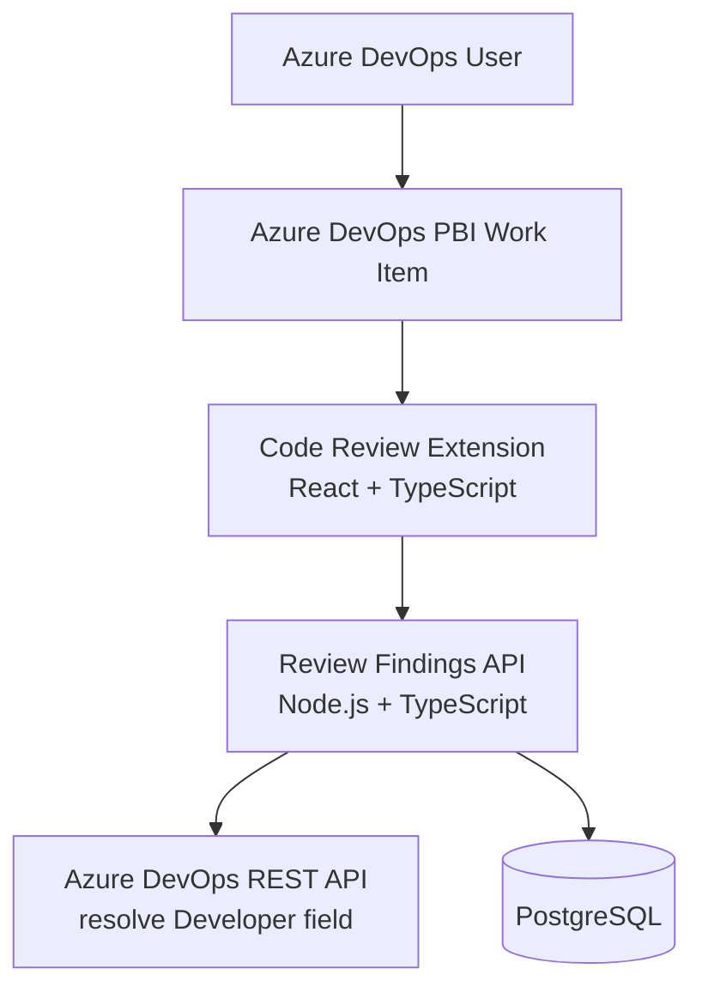
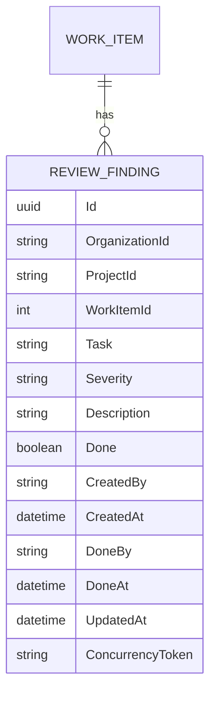
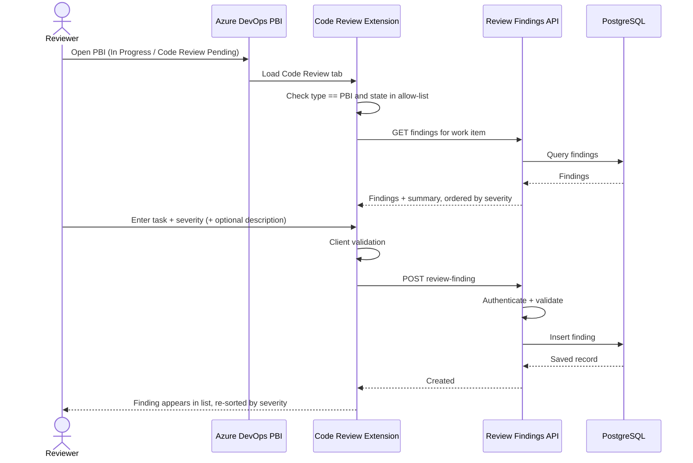
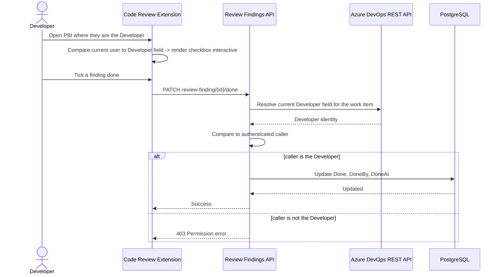

# Architecture

## Overview

The system reuses the same two-part shape already established for this Azure DevOps organization's extensions (see the Time Logger's `ARCHITECTURE.md`), adding a new work-item-form contribution and a new domain module rather than a new deployment:

1. **Azure DevOps Extension** — a new **Code Review** page/tab inside the PBI work-item form.
2. **Review Findings API + Database** — authoritative persistence and authorization for findings, added as a new module alongside the existing API.



## Why extend the existing extension/API rather than build a new stack

The organization already operates an Azure DevOps extension (React + TypeScript), a Fastify + Prisma + PostgreSQL API on Vercel, and an established identity mode. Standing up a second extension package and a second deployed API for a lightweight checklist feature would duplicate infrastructure, auth plumbing, and CI without a clear benefit. See `DECISIONS.md` for the explicit decision and its trade-offs.

## Azure DevOps extension

### Contribution

A work-item-form **page/tab** named `Code Review`, contributed alongside the existing `Time Logs` tab from the same extension package (or a closely related package sharing the same publisher/manifest conventions).

### Visibility

Azure DevOps work-item-form page contributions render inside the form regardless of type/state by default. Because the current SDK/contribution model does not reliably support server-declared conditional visibility by field value across all Azure DevOps deployments, the extension itself performs the type/state check on load:

1. Read work-item type and state from the form context.
2. If type is not `Product Backlog Item`, or state is not in the configured allow-list (`In Progress`, `Code Review Pending`), render nothing (or a minimal "not applicable" placeholder) instead of the checklist UI.
3. Re-evaluate when the form's type or state field changes without a full reload, where the SDK exposes a field-changed event.

This is a client-side UX gate, not a security boundary — see Authorization below.

### Extension responsibilities

The extension is responsible for:

- reading current work-item type, state, ID, and Developer field from the form context;
- reading current user identity through the organization's established identity mode;
- applying the type/state visibility gate described above;
- rendering the findings list, ordered by severity;
- rendering the add-finding form;
- rendering checkboxes as interactive only when the current user matches the Developer field, and read-only otherwise;
- calling the Review Findings API;
- displaying loading, success, validation, and error states.

The extension is **not** responsible for:

- deciding who is authorized to toggle a finding (it renders accordingly, but the API re-checks);
- being the permanent findings data store;
- storing secrets.

## Backend

### Technology

The Review Findings module is added to the existing Node.js + TypeScript + Fastify API, using the existing Prisma + PostgreSQL setup, rather than a new service.

```text
src/api/
├── modules/
│   ├── time-logs/         (existing)
│   └── review-findings/   (new)
│       ├── routes.ts
│       ├── service.ts
│       └── repository.ts
```

### Responsibilities

The backend owns:

- validation of finding creation (task text, severity value);
- ordering/summary calculation;
- persistence;
- authorization for the done/not-done toggle — resolved against the work item's **live** Developer field, not a client-asserted role.

### Resolving the Developer field for authorization

Because "is this user the Developer" is a fact about the work item, not about the findings table, the API resolves it at request time:

1. On a toggle request, the API fetches the work item's current `System.AssignedTo`-equivalent custom **Developer** field (the exact reference name depends on the process template) via the Azure DevOps REST API, using the same authenticated context the organization's other API calls already use.
2. The API compares the resolved Developer identity to the authenticated caller's identity (from the established identity mode).
3. If they do not match, the API returns a permission error and does not toggle the record.

This mirrors the existing extension's approach of not trusting client-supplied ownership flags (see the Time Logger's `ARCHITECTURE.md` and `DECISIONS.md` ADR-009).

A short-lived cache of the resolved Developer field per work item may be introduced later if the extra Azure DevOps REST call becomes a measured latency problem; it is not required for MVP correctness.

## Authentication

Authentication reuses whichever identity mode is currently accepted for this organization's extensions (see the Time Logger's `DECISIONS.md` for the current mode and its constraints). The Code Review module does not introduce a new authentication mechanism; it only adds a new authorization rule (Developer-field match) on top of the existing authenticated identity.

## Core domain model



`Severity` is stored as a fixed enum: `Minor`, `Low`, `Medium`, `High`, `Critical`.

## Suggested database table

```sql
ReviewFindings
--------------
Id                 uuid
OrganizationId     varchar
ProjectId          varchar
WorkItemId         integer
Task               text
Severity           varchar(16)   -- Minor | Low | Medium | High | Critical
Description        text nullable
Done               boolean default false
CreatedBy          varchar
CreatedAt          timestamptz
DoneBy             varchar nullable
DoneAt             timestamptz nullable
UpdatedAt          timestamptz
Version            concurrency token
```

Recommended indexes:

```text
(OrganizationId, ProjectId, WorkItemId, Severity)
```

## Add-finding flow



## Toggle-done flow



## API boundary

Initial API shape:

```text
POST   /api/review-findings
GET    /api/review-findings?workItemId={id}
PATCH  /api/review-findings/{id}/done
GET    /api/review-findings/summary?workItemId={id}
```

All queries must be scoped by organization/project context as well as work-item ID, consistent with the existing Time Logger endpoints.

## Error model

Reuses the existing API's stable machine-readable error shape:

```json
{
  "code": "REVIEW_FINDING_VALIDATION_FAILED",
  "message": "The review finding is invalid.",
  "errors": {
    "severity": ["Severity must be one of Minor, Low, Medium, High, Critical."]
  },
  "correlationId": "..."
}
```

## Configuration

```text
Supported work-item type (default: Product Backlog Item)
Supported states allow-list (default: In Progress, Code Review Pending)
Developer field reference name (process-template specific)
```

Making the type/state allow-list configurable avoids hard-coding assumptions that may not hold across every project's process template.

## Testing strategy

### Extension

- component tests for the visibility gate (type/state combinations);
- component tests for read-only vs. interactive checkbox rendering based on current-user-vs-Developer;
- severity-ordering rendering tests;
- API client tests.

### API

- unit tests for validation (task required, severity enum);
- unit tests for severity ordering and summary calculation;
- integration tests for the Developer-field authorization check, including the case where the API's resolved Developer differs from the client's assumption;
- authorization tests for a non-Developer attempting the toggle.

## Deployment shape

No new deployment is introduced. The Review Findings module ships as part of the existing Fastify application already deployed on Vercel Functions, using the existing pooled PostgreSQL database and the existing Prisma migration process. A new Prisma migration adds the `ReviewFindings` table.

```text
Azure DevOps Extension Package (Time Logs + Code Review tabs)
            +
Existing Fastify API on Vercel Functions (new module)
            +
Existing managed PostgreSQL Database (new table)
```

The Fastify application uses Vercel's supported `src/server.ts` entry-point
detection and deploys as one Node.js Function. The extension bundle is not served
by that function; it is packaged into the Azure DevOps VSIX separately. Required
runtime configuration and migration steps are documented in `VERCEL.md`.
